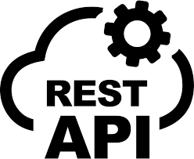

# Introduction au Protocole HTTP et au REST API

## Qu'est-ce que le protocole HTTP ?

HTTP (HyperText Transfer Protocol) est un protocole de communication utilisé pour échanger des données sur le web. Il est basé sur un modèle client-serveur où :
- **Le client** (navigateur ou application) envoie une requête au serveur.
- **Le serveur** répond avec les données demandées ou un message d'erreur.

### Caractéristiques principales :
- Basé sur des requêtes et réponses.
- Fonctionne via les méthodes (ou verbes) HTTP :
  - **GET** : Récupérer des données.
  - **POST** : Envoyer des données au serveur.
  - **PUT** : Mettre à jour des données.
  - **DELETE** : Supprimer des données.

### Exemple de requête HTTP :
```http
GET /api/users HTTP/1.1
Host: example.com
```

### Exemple de réponse HTTP :
```http
HTTP/1.1 200 OK
Content-Type: application/json

{
  "users": [
    {"id": 1, "name": "Alice"},
    {"id": 2, "name": "Bob"}
  ]
}
```

## Qu'est-ce qu'une REST API ?

REST (REpresentational State Transfer) est une architecture pour concevoir des services web basés sur HTTP. Une API REST expose des points d'entrée (endpoints) pour permettre aux clients d'interagir avec des ressources.

### Principes clés de REST :
1. **Basé sur HTTP** : Utilise les méthodes HTTP pour interagir avec les ressources.
2. **Stateless** : Chaque requête est indépendante et contient toutes les informations nécessaires.
3. **Représentation des ressources** : Les ressources (utilisateurs, articles, etc.) sont représentées sous forme de JSON, XML, etc.
4. **URI explicites** : Les URI identifient clairement les ressources (exemple : `/users/1` pour un utilisateur spécifique).

### Exemple d'Endpoints REST :
| Méthode | URI            | Action                |
|---------|----------------|-----------------------|
| GET     | /users         | Récupérer tous les utilisateurs |
| GET     | /users/1       | Récupérer un utilisateur spécifique |
| POST    | /users         | Créer un utilisateur |
| PUT     | /users/1       | Mettre à jour un utilisateur |
| DELETE  | /users/1       | Supprimer un utilisateur |

### Exemple de requête REST :
```http
POST /api/users HTTP/1.1
Host: example.com
Content-Type: application/json

{
  "name": "Charlie",
  "email": "charlie@example.com"
}
```

### Exemple de réponse REST :
```http
HTTP/1.1 201 Created
Location: /api/users/3

{
  "id": 3,
  "name": "Charlie",
  "email": "charlie@example.com"
}
```

REST API permet de connecter applications et services de manière standardisée, tout en restant simple à utiliser.


